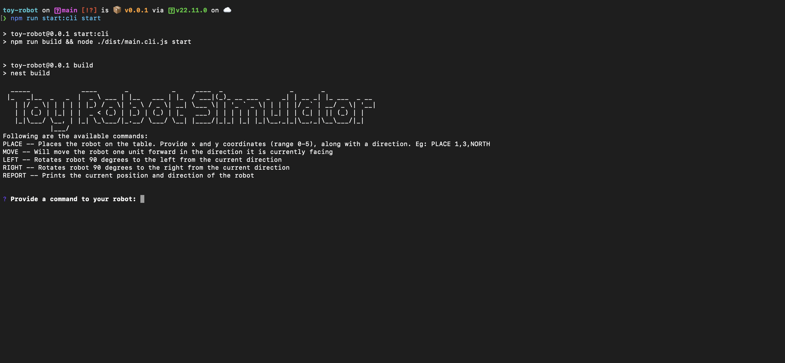

# Toy Robot Simulator

Move your toy robot on a square tabletop, of dimensions 5 units x 5 units.



## Setup

To get started with the Toy Robot Simulator, follow these steps:

1. Clone the repository:

   ```bash
   git@github.com:ankkho/toy-robot-simulator.git
   ```

2. Navigate into the project folder:

   ```bash
   cd toy-robot-simulator
   ```

3. Install the required dependencies:
   ```bash
   npm i
   ```

## Run the app

To run the application in the CLI mode:

```bash
npm run start:cli start
```

This will start the Toy Robot Simulator app in the command line interface.

## Exit the app

To exit the application, press `Ctrl + x (for windows) or control + x (for mac)`:

## Run tests

To run the tests for the project, use the following command:

```bash
npm run test
```

This will execute the tests and show the results in the terminal.

## Docker

To build and run the application with Docker, use the following command

```bash
npm run build
docker build -t toy-robot .
docker run --rm -it toy-robot
```

## How to update the table dimensions?

You can update the below coordinates in `.env` file. Restart the app after updating your configuration.

```bash
TABLE_MAX_X_COORDINATE=5
TABLE_MAX_Y_COORDINATE=5
```

## Documentation

```bash
npm run docs
```

For detailed documentation, run the above command and visit [Docs](docs/index.html).
